# 실제 Codex 작업을 보며 따라하기

기록일: **2026-10-04 (한국 시간)**. Codex CLI **0.159.2**, Node.js **22.23.3**, Next.js **16.3.8**, macOS에서 실제 실행했습니다. 공개 샘플 STEP-02의 복사본에 이름 검색을 요청했습니다. 계정·인증키·실제 개인정보는 자료에 포함하지 않았습니다.

Codex 데스크톱 앱 창은 캡처 도구의 접근 제한으로 캡처하지 못했습니다. 아래 Codex 이미지 4장은 **실제 CLI 실행 기록을 브라우저에 표시해 캡처한 것**입니다. 앱 이미지 7장은 실제 로컬 서버의 브라우저 화면입니다. 네이티브 Codex 앱의 버튼 위치를 보여 주는 자료와 구분해서 사용하세요.

## 그대로 시작하기

1. [실습 자료실](https://suseong-ai-vibe-coding.pages.dev/practice)에서 STEP-02 ZIP을 받아 새 폴더에 풉니다. 원본은 보관하고 복사본으로 실습합니다.
2. Node.js 22.x를 확인하고 그 폴더에서 `npm ci`를 실행합니다. README와 `app/library-browser.js`, `data/records.json`을 확인합니다.
3. Codex 앱에서 그 폴더를 프로젝트로 열거나, [공식 CLI 안내](https://learn.chatgpt.com/docs/codex/cli)에 따라 CLI를 설치·로그인하고 폴더 안에서 `codex`를 실행합니다.
4. [실제 사용한 요청문](codex-run/prompt.md)을 보냅니다. 한 번에 이름 검색 하나만 요청합니다. 생성된 파일을 읽고 `npm test`, `npm run build` 결과를 확인합니다.
5. 별도 터미널에서 `npm run dev`를 실행하고 서버가 안내한 로컬 주소를 엽니다. Windows는 `npm.cmd`를 사용할 수 있습니다.
6. 빈 검색어 3건 → `도서관 B` 1건 → `없는도서관` 0건 → 초기화 3건을 직접 확인합니다. ` 도서관 B `도 1건인지 비교합니다.

이번 실제 시연본은 입력 즉시 검색합니다. 배포 STEP-03 정상본은 검색 버튼을 누릅니다. AI가 만드는 코드와 화면은 달라질 수 있으며 같은 입력·기대 결과로 판정하세요. 최신 정상본에는 오래된 조회 응답을 막는 보강도 포함돼 있습니다. 시연 당시 [변경 전 화면 코드](codex-run/before-library-browser.js)와 [변경 후 코드](codex-run/after-library-browser.js), [패치](codex-run/changes.patch), [새 테스트](codex-run/libraries-api.test.mjs)를 별도로 보존해 비교할 수 있습니다. 패치를 최신 정상본에 자동 적용하는 절차는 제공하지 않습니다.

## 요청 → 변경 → 검증의 실제 기록

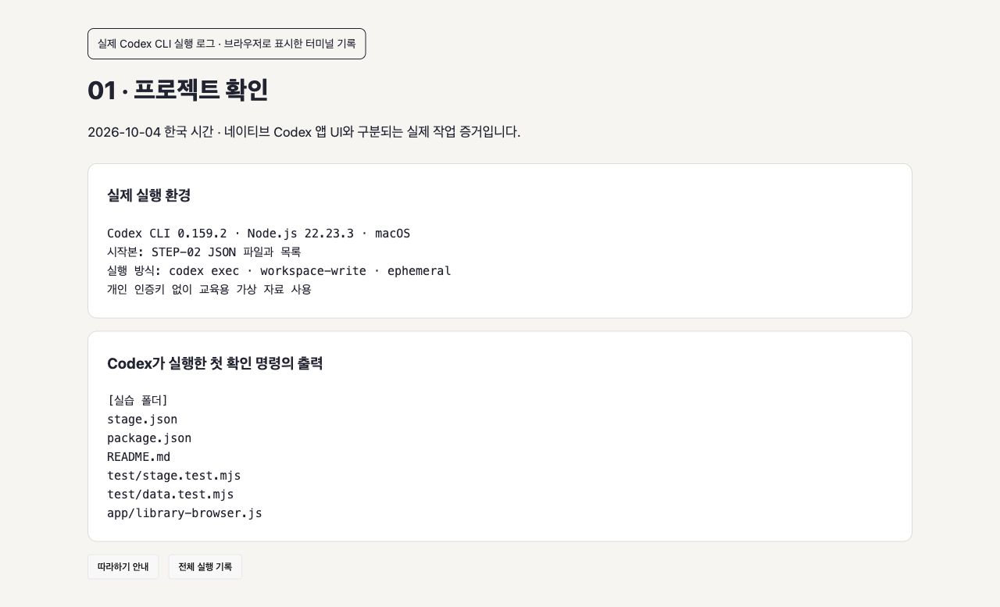

실제 Codex가 STEP-02 복사본의 파일을 확인했습니다. [전체 명령·출력 기록](codex-run/transcript.md)의 임시 경로는 `[실습 폴더]`로 표시했습니다. 내부 추론·세션 식별자·도구 경고는 공개 기록에서 제외했습니다.

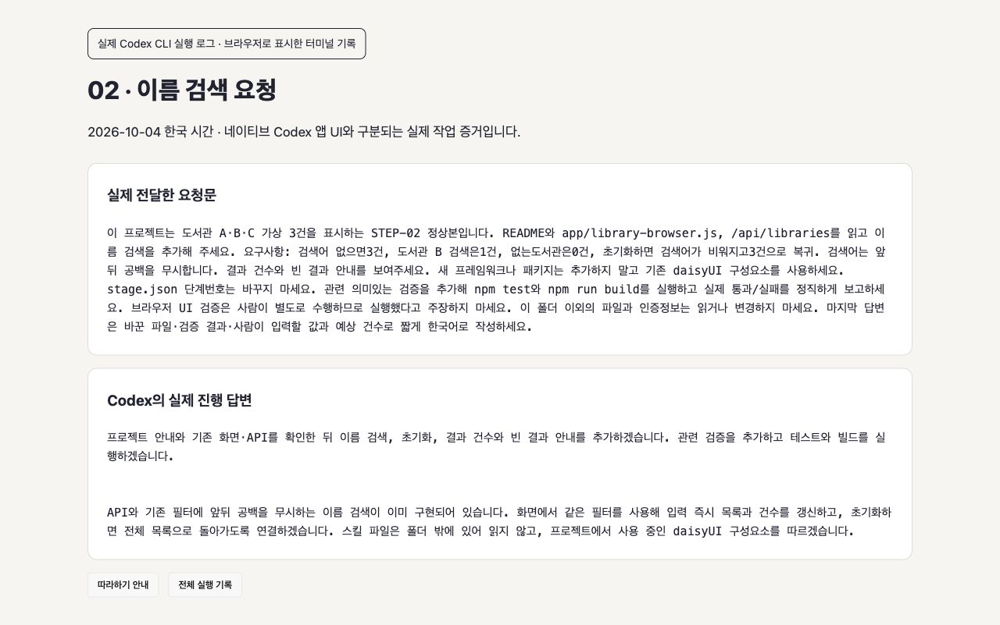

요청에 입력값·기대 건수·초기화·공백 처리와 검증 방법을 함께 넣었습니다.

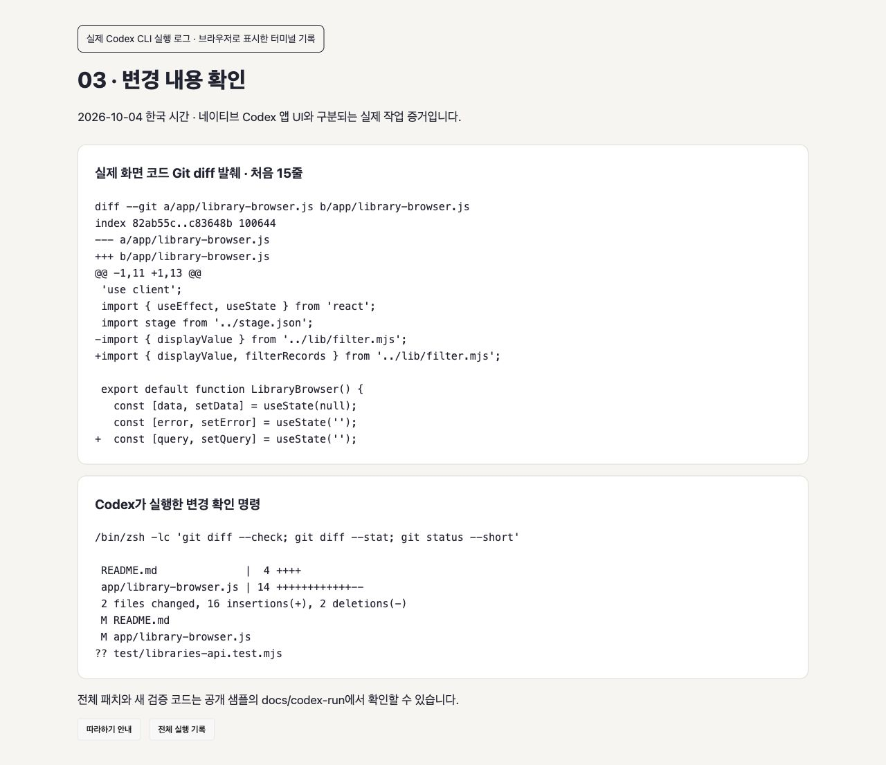

화면 파일과 README를 변경하고 API 검증 2건을 추가했습니다. 단계 번호와 패키지는 변경하지 않았습니다.

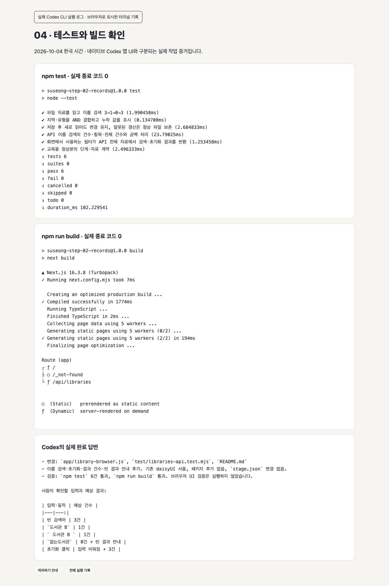

실제 시연본의 테스트 6건과 빌드가 성공했습니다. Codex는 브라우저 UI 검증을 하지 않았다고 밝혔고, 이후 사람이 아래 화면과 동작을 직접 확인했습니다.

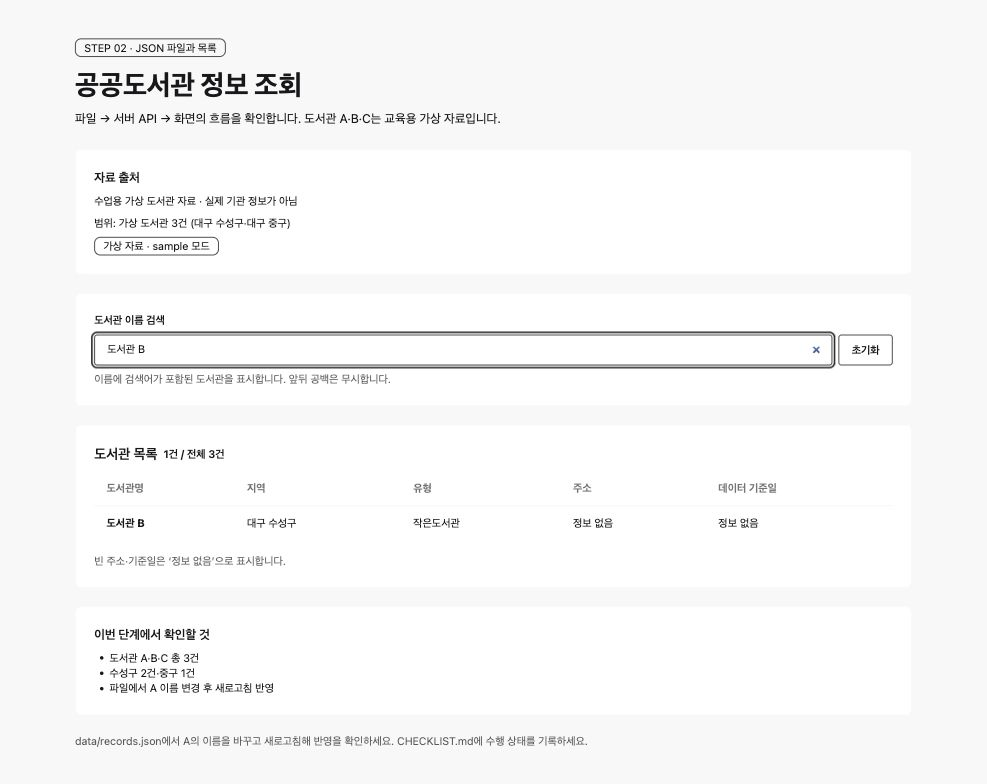

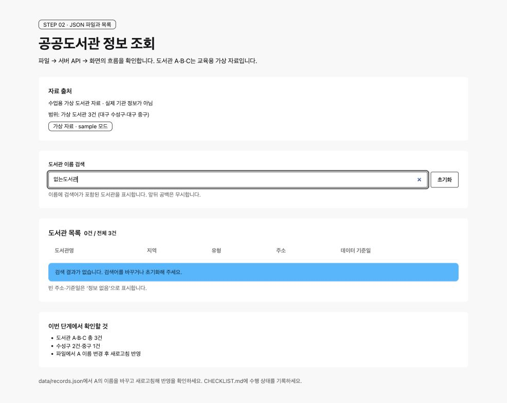

표에 보이는 STEP-02는 시작본 번호입니다. 이 두 장은 STEP-02에 검색을 더한 실제 시연본이며 배포 STEP-03의 화면을 복제한 이미지가 아닙니다. 초기화를 눌러 전체 3건으로 복귀하는 것도 확인했습니다.

## 다른 정상본에서 확인할 실제 결과

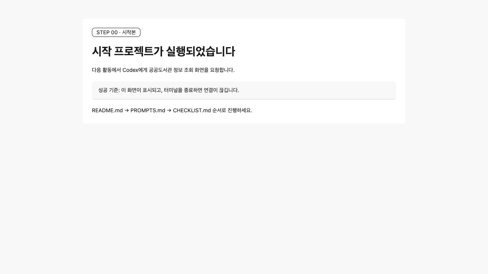

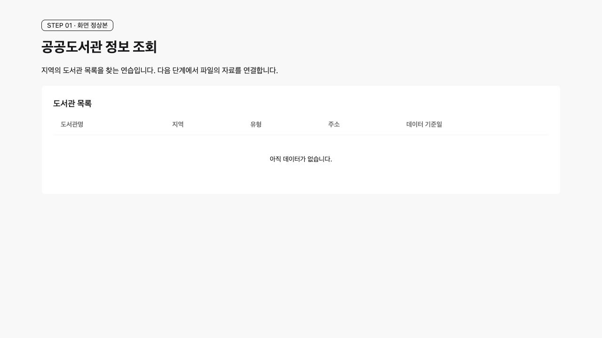

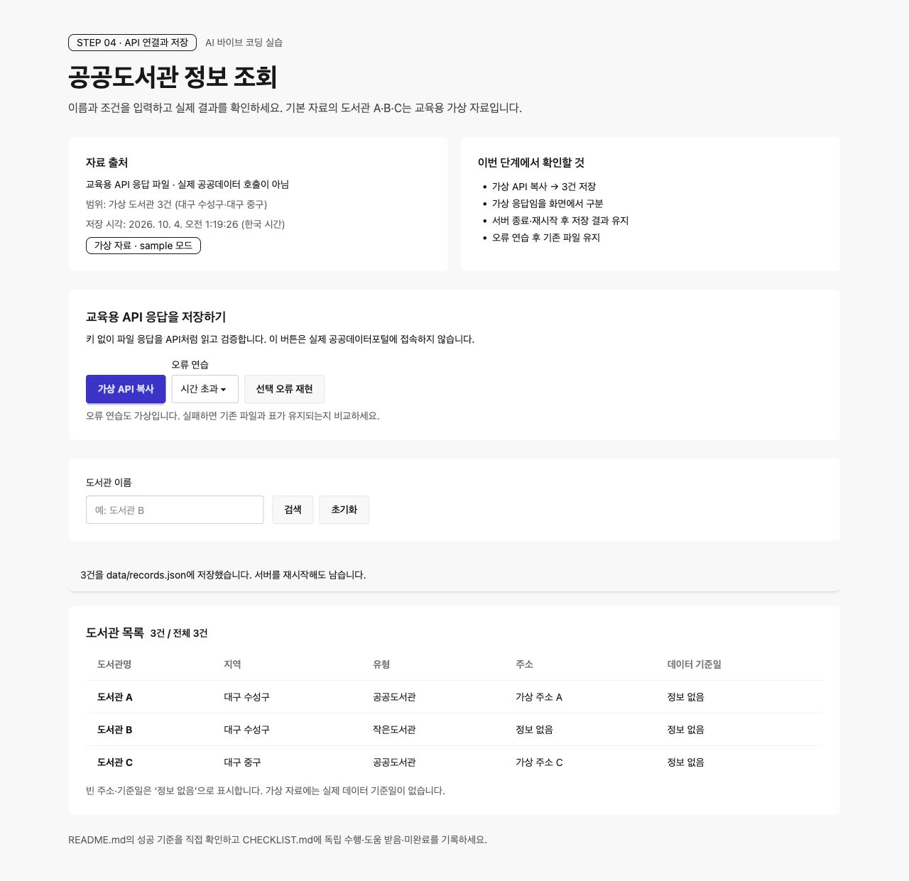

STEP-04에서 가상 API 복사 후 3건과 저장 시각을 확인했습니다. 서버를 종료·재시작한 뒤 같은 저장 시각·3건·가상 출처가 유지됐습니다. 실제 공공데이터 인증 호출을 수행한 이미지는 아닙니다.

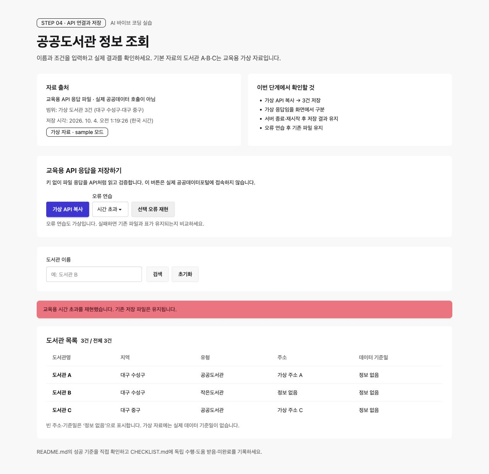

시간 초과·응답 형식·인증 오류를 각각 재현했습니다. 기존 저장 파일의 SHA-256이 변하지 않고 표 3건이 유지되는 것을 확인했습니다.

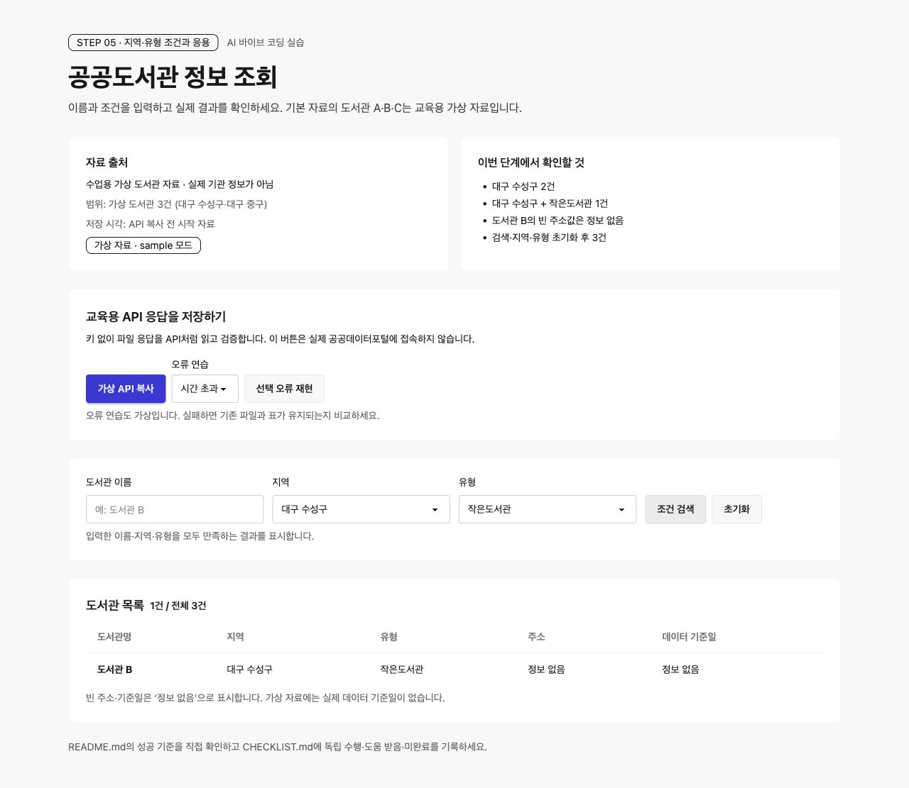

STEP-05에서 대구 수성구 2건 → 작은도서관 조건 추가 1건 → 초기화 3건을 확인했습니다. 빈 주소는 ‘정보 없음’입니다.

각 단계의 CHECKLIST.md에 날짜·입력·기대·실제와 독립 완료/지원받아 완료/미완료를 기록하세요. 실제 공공 API 인증 호출과 Windows PC 실행은 이번 실측에서 **미확인**입니다.
